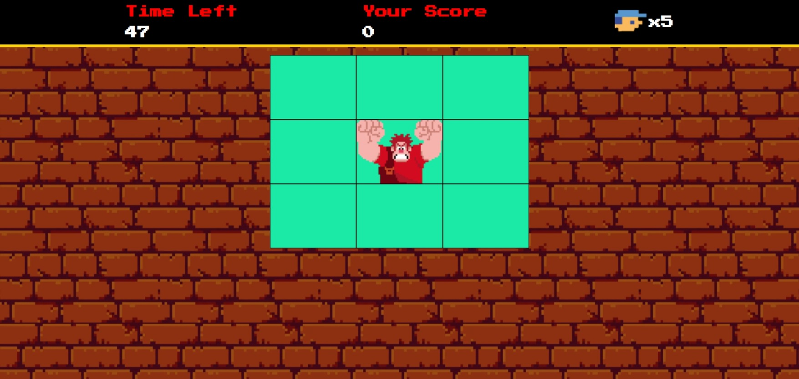

# Detona Ralph Game JS

Bem vindo as detona Ralph Game JS! Nesse repositório, você encontrará um jogo divertido baseado no famoso filme "Detona Ralph". Este projeto não apenas oferece entretenimento, mas também demonstra várias técnicas avançadas de desenvolvimento de jogos em JavaScript.

## Tecnologias utilizadas
- HTML5 e CSS3 para estrutura e aparência do jogo.
- JavaScript para a lógica de programação e interatividade.

## Funcionalidades Incríveis
- **Sistema de Pontuação:** Acompanhe sua pontuação à medida que progride no jogo, clique no quadrado que o Ralph se encontre.

## Como Jogar
1. Clone este repositório para sua maquina local.
2. Abra o arquivo `index.html` em sua navegador web.
3. Agora é só se divertir.

[Clique aqui](https://glauciofelix.github.io/detona-ralph-game-js/) para acessar o resultado final da landing page criada a partir do desafio!

---

## Créditos
Este jogo foi desenvolvido como parte de um projeto educacional da Digital Innovation One.

